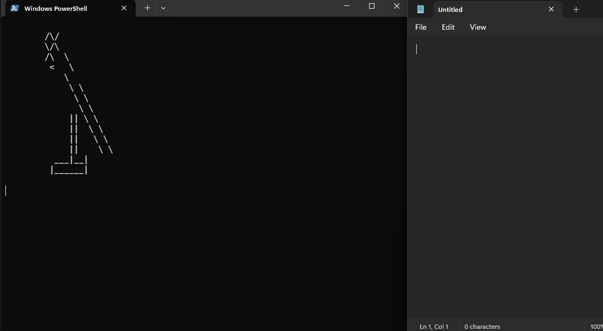

# Drinking Bird Simulator

Does your job involve pressing the same key on a keyboard all day?
Do you want this job to be automated for you, so you can pop out and watch a movie.
Well the drinking bird has your back. Simply follow the instructions below and automate
your work tasks.

## Requirements

- Python 3.10+
- [Python Poetry](https://python-poetry.org/docs/)

**Note:** Can only run in Powershell.

## Installation

Clone this repository to your local machine and change into the directory.

The repository is set up to use [Poetry](https://python-poetry.org/) for dependency management.
If you've got poetry, use the following from within the project folder to install dependencies and run
in your Powershell terminal:

    poetry install

## Usage

To run the drinking bird simulator, run the following command:

    poetry run python drinkingbird.py

Once it starts running, you have 10 seconds to click on the window/program that you want
the drinking bird to automate for you. But be sure to keep the terminal in view so
that you can see the drinking bird in action.

If you want to cancel the script early, press `Ctrl + c` in your terminal.

## Options

You can specify the key (numbers/letters/symbols) that the drinking bird presses with the `-k` or `--key` option.

You can specify the number of times that it presses a key for you with the `-r` or `--rounds` option.

For example, if you want the drinking bird to press the `e` key 10 times, simply run:

    poetry run python drinkingbird.py -k e -r 10

## Current Limitations

Can only press number/letter/symbol keyboard keys. Future versions will aim to include the ability to press other
keys such as `Enter`.
